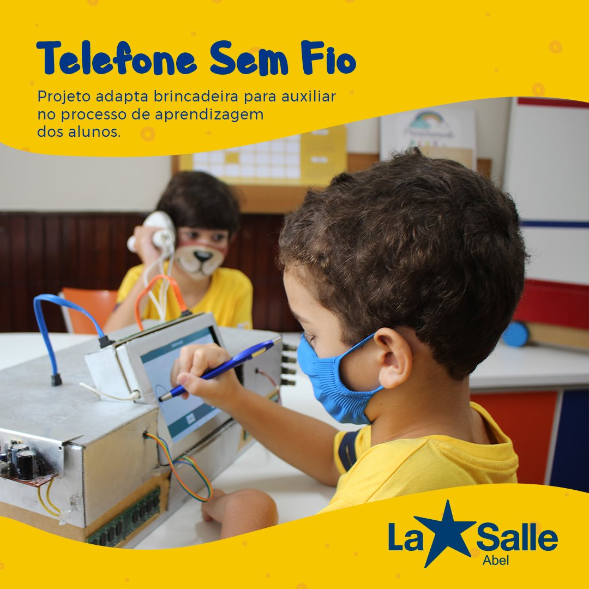
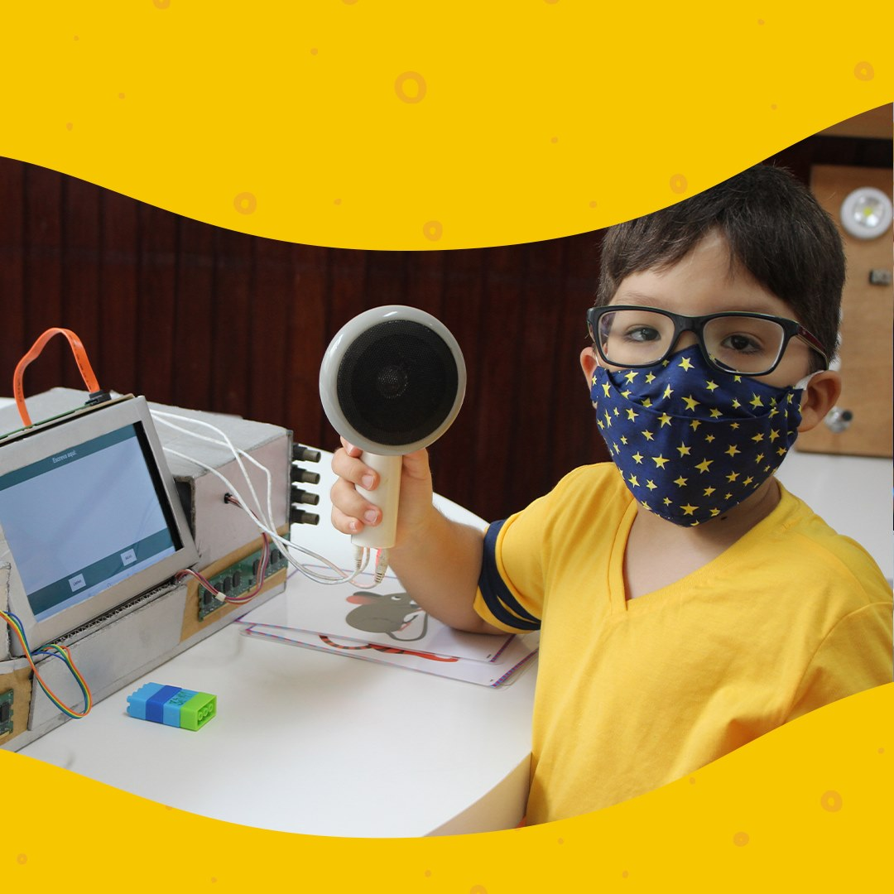
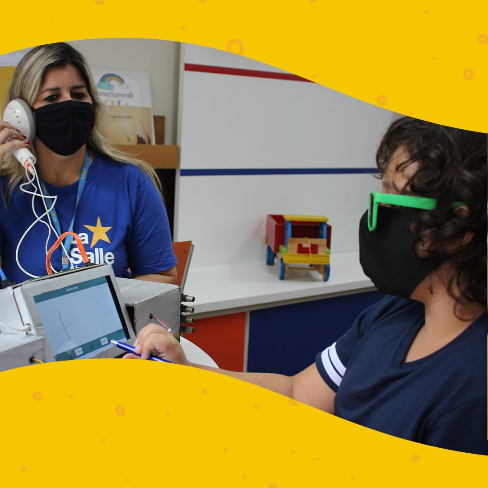
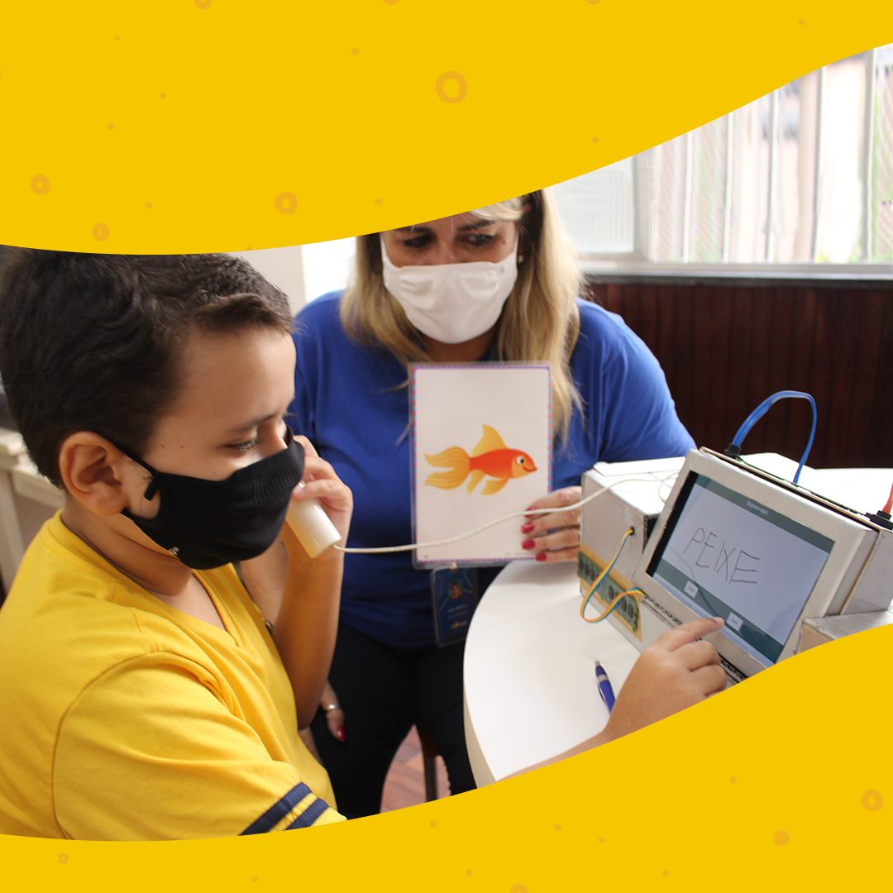
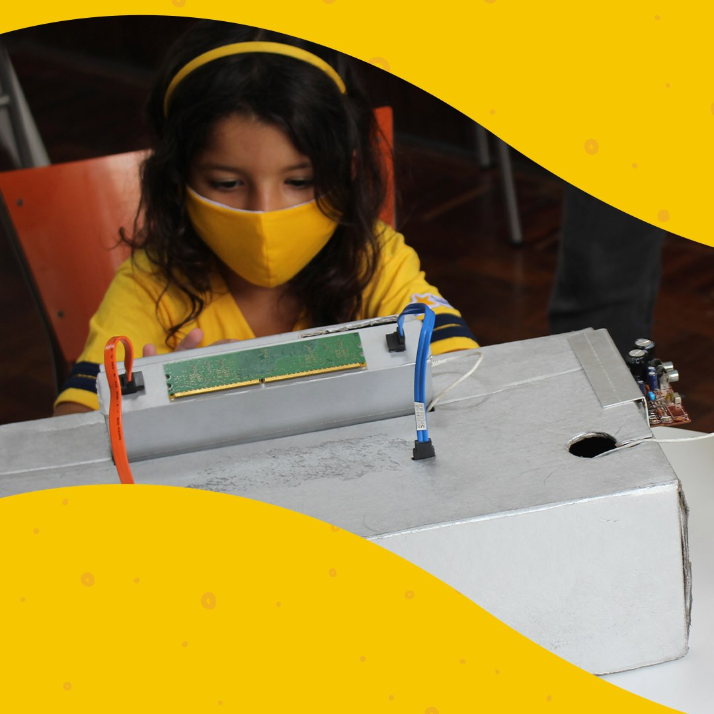

# Telefone Sem Fio

 

Projeto desenvolvido em 2019 na escola La Salle Abel para atender alunos da Assistência Educacional Especializada
 
### Post da escola La Salle Abel em suas redes sociais 
"Vamos brincar de Telefone Sem Fio? 
 No projeto desenvolvido por João Victor Simonassi e Eduardo Levy,
 esta antiga brincadeira é atualizada para auxiliar os
 alunos do nosso Atendimento Educacional Especializado.

 Na atividade, um estudante seleciona uma imagem e a 
 escreve da forma que consegue a palavra correspondente à imagem no aparelho.
 O sistema reconhece a grafia do aluno e converte em forma de áudio. 
 Outros alunos, sem saberem a imagem escolhida, precisam identificá-la através do áudio gerado no fone de ouvido.
 Demais, não é? O projeto foi um sucesso entre os estudantes e promete ajudar de maneira lúdica muitos jovens lassalistas."
#
Project developed in 2019 at the La Salle Abel school to help students Specialized Educational Assistance

### La Salle Abel School Reviews 
  "Let's play Cordless Phone?
  In the project developed by João Victor Simonassi and Eduardo Levy,
  this old game is updated to help
  students from our Specialized Educational Service.

  In the activity, a student selects an image and the
  write the way you get the word corresponding to the image on the device.
  The system recognizes the student's spelling and converts it to audio.
  Other students, without knowing the chosen image, need to identify it through the audio generated in the headset.
  Too much, isn't it? The project was a success among students and promises to help many young Lasallians in a playful way."
